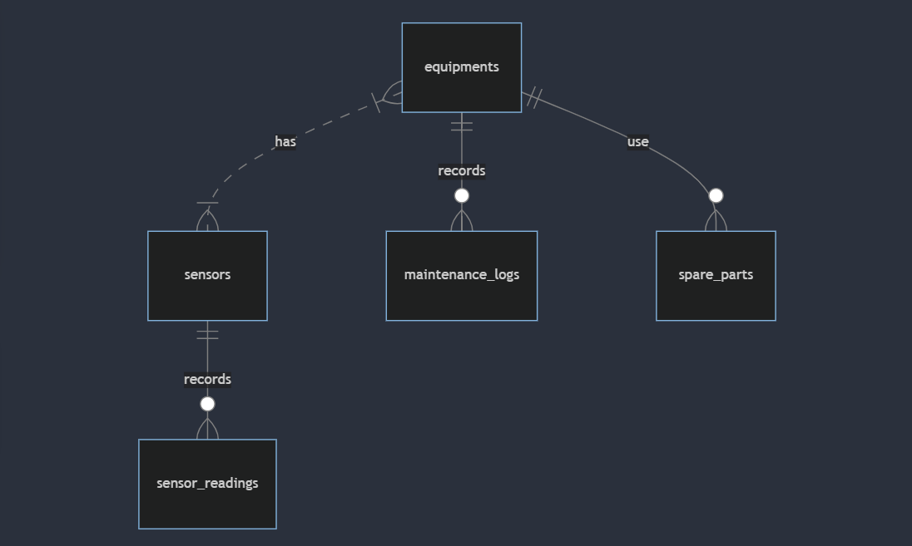

# Design Document

By Yoong Sin

Video overview: <https://youtu.be/LhAS1EEvHG0>

## Purpose

This database is designed to support a predictive maintenance system. It aims to store and manage data related to equipment health, sensor readings, maintenance logs, and spare parts. The system can be used to:

- Monitor equipment health through sensor data.
- Identify potential equipment failures before they occur.
- Schedule preventive maintenance activities to minimize downtime.
- Track maintenance history and manage spare parts inventory.

## Scope
The database focuses on the core functionalities of a predictive maintenance system. It includes essential entities like equipment, sensors, sensor readings, maintenance logs, and spare parts.

This design can be further extended to incorporate additional features such as:

- User management for access control.
- Alerting system for notifications on critical events.
- Integration with data visualization tools for data analysis.

## Functional Requirements

### Detailed User Roles and Permissions:

* Maintenance Technician:
    * View equipment health data
    * Schedule preventive maintenance
    * Record maintenance activities
    * Access spare part inventory
* Engineer:
    * Analyze sensor data
    * Develop predictive models
    * Configure system settings
    * Generate reports
* Administrator:
    * Manage user accounts and permissions
    * Monitor system performance
    * Implement updates and upgrades
### User Capabilities

Users of the predictive maintenance database should be able to:

* **Query and retrieve data**:
    * Search for equipment by name, type, or other attributes.
    * Retrieve sensor readings for specific equipment or time periods.
    * View maintenance history, including preventive, corrective, and predictive activities.
    * Access information about spare parts, including quantity and availability.

* **Analyze data**:
    * Identify trends and patterns in sensor data to detect anomalies.
    * Compare equipment performance over time.
    * Evaluate the effectiveness of maintenance strategies.

* **Generate reports**:
    * Create customized reports on equipment health, maintenance activities, and spare part usage.
    * Export data to external formats for further analysis or integration with other systems.

## Representation
### Entities

The database schema consists of the following primary entities:

* **`equipments`**: Represents physical machines or components within the system. Attributes include type, name, manufacturer, model number, serial number, installation date, and last maintenance date.
* **`sensors`**: Represents devices attached to equipment that collect data on various parameters like temperature, vibration, or pressure. Attributes include type, location, and calibration date. Each sensor is linked to a specific equipment through a foreign key relationship.

* **`sensor_readings`**: Stores individual sensor measurements captured at a specific timestamp. Attributes include sensor ID, timestamp, and value. A foreign key references the sensor that generated the reading.
* **`maintenance_logs`**: Records performed maintenance activities on equipment. Attributes include equipment ID, maintenance type (preventive, corrective, predictive), start and end dates, performed by (personnel), and notes. A foreign key references the equipment that underwent maintenance.
* **`spare_parts`**: Represents spare components used for equipment maintenance. Attributes include part name, serial number (optional), equipment type compatibility, and quantity in stock. A foreign key can be added to link spare parts to specific equipment if needed.

### Relationships
The database includes the following entities:

### Data Model and Schema
* `equipmments`:
    * `id`: INT (primary key) - Unique integer identifier for each equipment.
    * `type`: VARCHAR(32) (not null) - text string representing the type of equipment.
    * `name`: VARCHAR(32) (not null) - text string representing the name or label of the equipment.
    * `manufacturer`: VARCHAR(32) (not null) - text string representing the manufacturer of the equipment.
    * `model_number`: VARCHAR(32) (not null) - text string representing the model number of the equipment
    * `serial_number`: VARCHAR(32) (unique) - text string representing the unique serial number of the equipment.
    * `installation_date`: DATE (not null) - date representing the date the equipment was installed.
    * `last_maintenance_date`: DATE - date representing of the last maintenance performed on the equipment.

* `sensors`:
    * `id`: INT (primary key) - unique integer identifier for each sensor.
    * `type`: VARCHAR(32) (not null) - text string representing the type of sensor.
    * `equipment_id`: INT (foreign key references Equipments.id) - integer referencing the `equipment_id` the sensor is attached to.
    * `location`: VARCHAR(32) (not null) - text string representing the location of the sensor on the equipment.
    * `calibration_date`: DATE (not null) - date representing the date the sensor was last calibrated.

* `sensor_readings`:
    * `id`: INT (primary key) - unique integer identifier for each sensor reading.
    * `sensor_id`: INT (foreign key references sensor.id) -  integer referencing the sensor ID that generated the reading.
    * `timestamp`: DATETIME (not null) - timestamp representing the time the reading was taken.
    * `value`: NUMERIC - numeric value representing the measured value from the sensor.

* `maintenance_logs`:
    * `id`: INT (primary key) - unique integer identifier for each maintenance log.
    * `equipment_id`: INT (foreign key references Equipments.id) - integer referencing the equipment ID that underwent maintenance.
    * `maintenance_type`: VARCHAR(20) (not null, check constraint to ensure valid values) - text string representing the type of maintenance (e.g., preventive, corrective, predictive).
    * `start_date`: DATE (not null) - date representing the start date of the maintenance.
    * `end_date`: DATE - date representing the end date of the maintenance.
    * `performed_by`: VARCHAR(100) - text string representing the person who performed the maintenance.
    * `notes`: TEXT - text string containing additional notes about the maintenance.
* `spare_parts`:
    * `id`: INT (primary key) - unique integer identifier for each spare part.
    * `name`: VARCHAR(100) (not null) - text string representing the name of the spare part.
    * `serial_number`: VARCHAR(50) - text string representing the serial number of the spare part (optional).
    * `equipment_type`: VARCHAR(50) - text string representing the type of equipment the spare part is compatible with.
    * `quantity`: INT (not null) - integer representing the quantity of the spare part in stock.

## Optimizations

### Indexes
The schema utilizes indexes to improve query performance on frequently searched attributes:

* `equipment_search`: This index facilitates faster searches on the name column in the equipments table. This is beneficial for quickly finding specific equipment by name.
* `sparepart_search`: This index speeds up searches on the name column in the `spare_parts` table, allowing for efficient retrieval of spare parts by name.
* `last_maintenance_search`: This index optimizes queries that involve searching maintenance logs based on the `start_date` and `end_date` columns. This can be helpful for filtering maintenance activities within a specific date range.

### Views

The database incorporates materialized views to simplify complex queries and improve data retrieval efficiency:

* `preventive_maintenance`: This view pre-selects all rows from the maintenance_logs table where the maintenance_type is "Preventive." This allows for faster retrieval of preventive maintenance activities without needing to filter the entire table on every query.
* `predictive_maintenance`: Similar to the previous view, this one selects all rows from maintenance_logs where maintenance_type is "Predictive." It simplifies querying for predictive maintenance activities.
* `corrective_maintenance`: This view focuses on rows with maintenance_type as "Corrective" in the maintenance_logs table. It streamlines retrieving logs related to corrective maintenance actions.

## Limitations
* This basic design focuses on core functionalities and might require modifications for specific use cases.
* The schema doesn't currently include user management or an alerting system.
* Data validation logic needs to be implemented to ensure data quality.
* Scalability considerations for massive datasets might require further optimization.

## Future Considerations

* Implement user management and access control mechanisms.
* Develop an alerting system for critical events based on sensor data analysis.
* Integrate with data visualization tools for effective data exploration.
* Explore advanced techniques like machine learning for predictive maintenance algorithms.
